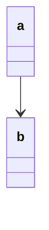
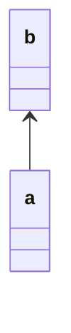

# Mermaid Class Tools

A VS Code extension that helps you write Mermaid syntax in Markdown.

> Japanese README: [README.md](./README.md)

> Contributor Guide: [CONTRIBUTING.md](./CONTRIBUTING.md)

> Changelog: [CHANGELOG.md](./CHANGELOG.md)

## Usage

There are currently five features:

1. Rename words inside Mermaid code blocks
2. Reverse arrows via Quick Fix
3. Check arrow meanings on hover
4. Arrow IntelliSense
5. Mermaid code block diagnostics

### 1. Rename

- Press `F2` on the word you want to rename inside a Mermaid code block, then change the name.
- Rename is limited to the same word within the same Mermaid code block and does not affect the entire Markdown document.

### 2. Reverse Arrows via Quick Fix

In Mermaid, diagram output can change depending on arrow direction and node order.
This quick fix helps you quickly adjust and verify the rendered result.

1. Move the cursor to a line containing an arrow.
2. Press `Ctrl + .` (`Cmd + .` on Mac), then choose the desired arrow conversion from Quick Fix candidates.

- Quick Fix candidates are shown based on the arrow type on the current line.
- Supported diagram types:
    - classDiagram
    - sequenceDiagram
    - stateDiagram
    - flowchart, graph
    - erDiagram

### 3. Check Arrow Meaning on Hover

Mermaid has many arrow styles, and it can be difficult—especially for beginners—to remember each meaning.
This feature shows role descriptions when you hover over an arrow.

- Hover over an arrow to see its meaning.
- Descriptions change based on both arrow type and diagram type.
- Display language switches between Japanese and English based on VS Code display language.

### 4. Arrow IntelliSense

Mermaid has many arrow styles, and this feature helps you discover and input available arrows with descriptions.

- Type part of an arrow inside a Mermaid code block to see candidates.
- Selecting a candidate inserts it as completion.
- Arrow candidates are switched based on diagram type.
- Supported diagram types:
    - classDiagram
    - sequenceDiagram
    - stateDiagram
    - flowchart, graph
    - erDiagram

### 5. Mermaid Code Block Diagnostics

- Detects Mermaid arrow syntax errors inside Mermaid code blocks and underlines error locations.
- Hover over an error line to see details.
- If a precise error location is unavailable, it shows a block-level diagnostic.

## Settings (Per-feature ON/OFF)

You can disable each feature individually in VS Code.
Open settings with `Ctrl + ,` (`Cmd + ,` on Mac) and search for `mermaidClassTools`.

- `mermaidClassTools.enableRename`: Rename feature
- `mermaidClassTools.enableArrowActions`: Quick fix for reversing arrows
- `mermaidClassTools.enableArrowHover`: Hover descriptions for arrows
- `mermaidClassTools.enableArrowCompletion`: IntelliSense suggestions for arrows
- `mermaidClassTools.enableDiagnostics`: Diagnostics for Mermaid code blocks

## Transformation Example

If you choose Quick Fix:
`Swap node positions, keep relation direction (example: a --> b → b <-- a)`
the following conversion is applied:

↓

## GitHub

https://github.com/OmojiP/mermaid-class-tools
