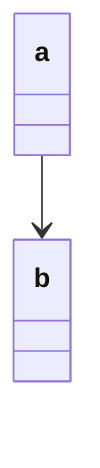
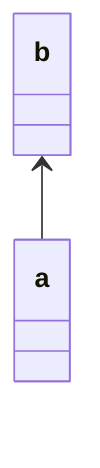

# Mermaid Class Tools

chatGPTに作ってもらった
Markdown内のMermaid記述を支援するVS Code拡張機能です。

> English README: [README.en.md](./README.en.md)

> Contributor Guide: [CONTRIBUTING.md](./CONTRIBUTING.md)

> Changelog: [CHANGELOG.md](./CHANGELOG.md)

## 使い方

現在実装されている機能は5つです。

1. mermaidコードブロック内の単語のリネーム
2. クイックフィックスで矢印の反転
3. ホバーで矢印の役割確認
4. 矢印のインテリセンス
5. Mermaidコードブロックの診断

### 1.リネーム

- リネームしたい単語ブロックの上でF2を押し、名前を変更します
- リネームの範囲は同一Mermaidコードブロック内の同一単語のみで、Markdown全体には影響しません

### 2.クイックフィックスで矢印の反転

mermaidでは矢印の向きやノードの登場順によって描画結果が変わるため、矢印の向きを変えたい場面が頻発します。
このクイックフィックスを使用することで即座に描画結果を確認できます。

1. 矢印のある行にカーソルを移動
2. `Ctrl + .`（Macは`Cmd + .`）を押し、クイックフィックスの候補から希望の矢印の反転を選択

- クイックフィックスの候補は、行の矢印の種類に応じて切り替わります
- 対応Diagramの種類
  - classDiagram
  - sequenceDiagram
  - stateDiagram
  - flowchart, graph
  - erDiagram

### 3.ホバーで矢印の役割確認

mermaidを使用していると矢印の種類が多く、特に初心者はどの矢印がどのような意味を持つのか把握するのが大変です。
この機能は、矢印にカーソルを重ねると、その矢印の役割説明が表示される機能です。

- 矢印にカーソルを重ねると矢印の役割説明が表示されます
- 役割の説明は、矢印の種類や図の種類に応じて切り替わります
- 表示言語はVS Codeの表示言語に合わせて日本語/英語で切り替わります

### 4.矢印のインテリセンス

mermaidを使用していると矢印の種類が多く、特に初心者はどの矢印がどのような意味を持つのか把握するのが大変です。
この機能は、利用可能な矢印の候補と役割説明を表示し、入力補完できる機能です。

- Mermaidコードブロック内で矢印の一部を入力すると、矢印の候補が表示されます
- 候補を選択すると、入力補完されます
- 矢印の種類は図の種類に応じて切り替わります
- 対応Diagramの種類
  - classDiagram
  - sequenceDiagram
  - stateDiagram
  - flowchart, graph
  - erDiagram

### 5.Mermaidコードブロックの診断

- Mermaidコードブロック内の矢印の記法エラーを検出し、エラー箇所に波線を表示します
- エラーのある行にカーソルを合わせると、エラー内容が表示されます
- エラー箇所を特定できない場合は、コードブロック全体にエラーがある旨の診断を表示します

## 設定（機能ごとのON/OFF）

VS Codeの設定で機能を個別に停止できます。
`Ctrl + ,`（Macは`Cmd + ,`）で設定を開き、`mermaidClassTools`で検索してください。

- `mermaidClassTools.enableRename` : リネーム機能
- `mermaidClassTools.enableArrowActions` : 矢印反転のクイックフィックス
- `mermaidClassTools.enableArrowHover` : 矢印説明のホバー
- `mermaidClassTools.enableArrowCompletion` : 矢印入力のインテリセンス
- `mermaidClassTools.enableDiagnostics` : Mermaidコードブロックの診断

## 適用例

クイックフィックスで「位置関係を逆転, 関係方向を保存（例：a --> b → b <-- a）」を選択すると、以下のように変換されます：

↓

## GitHub

https://github.com/OmojiP/mermaid-class-tools