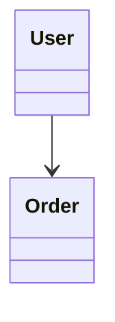
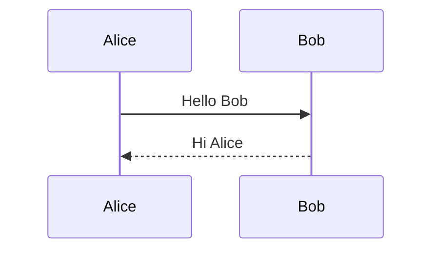
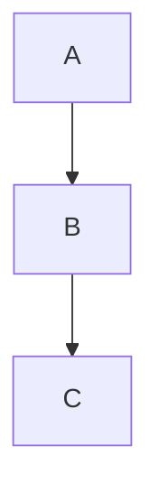
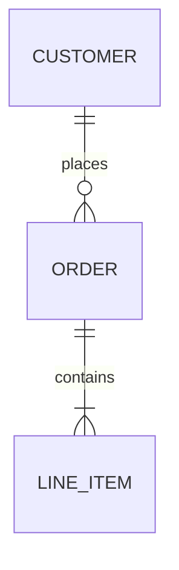
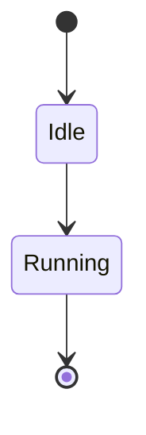

# Mermaid Class Tools Test

このファイルは拡張機能の動作確認用です。

## 1) classDiagram（正常）



```mermaid
classDiagram
    class User
    User --->
```

```mermaid
classDiagram
    namespace MyNamespace {
        class User
        class Order
    }
    User --> Order
    MyNamespace --> User
```

## 2) sequenceDiagram



```mermaid
sequenceDiagram
    Alice->>
```

```mermaid
sequenceDiagram
    Alice--oBob: Hello Bob
```

## 3) flowchart



```mermaid
flowchart TD
    A -->
```

## 4) erDiagram



```mermaid
erDiagram
    CUSTOMER ||--o{ : places
```

## 5) stateDiagram



```mermaid
stateDiagram-v2
    [*] -->
```

